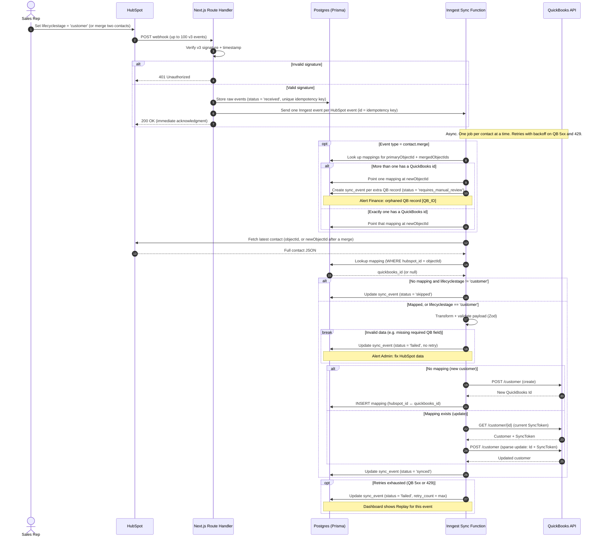
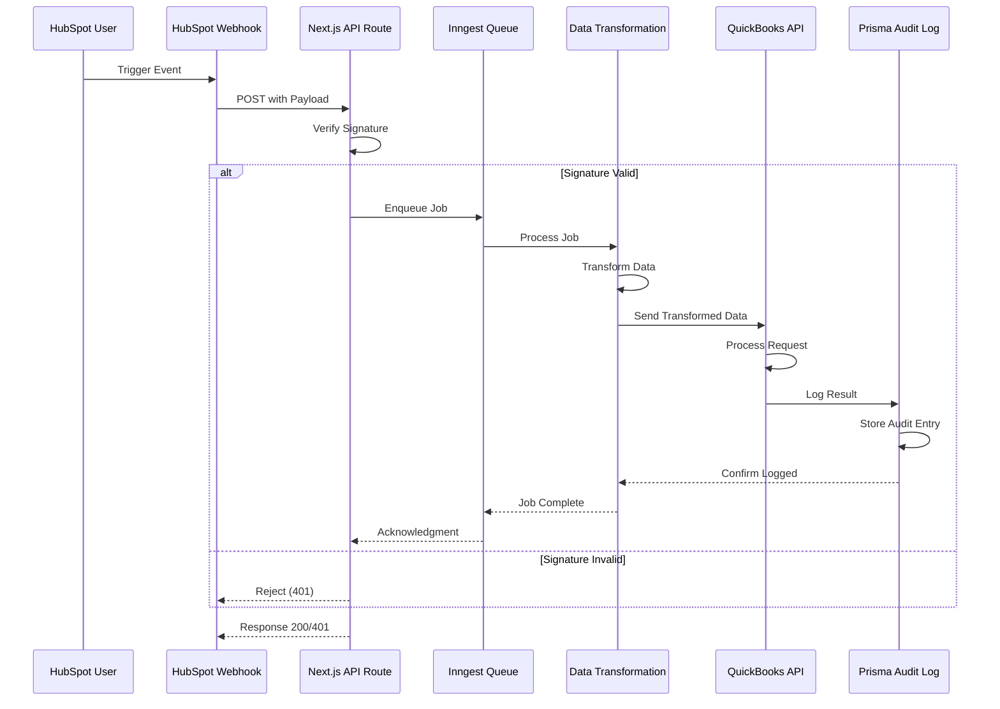

# Integration Design: HubSpot → QuickBooks Customer Sync

**Status:** Draft v3. Fixes all findings in [us-01-finding.md](us-01-finding.md). Decisions 1 and 2 made (2026-09-23). Signed off (simulated).
**Sign-off:** simulated, 2026-09-24, via `/drill biz us-01` (practice persona: Dana, CFO). Conditions: (1) a fixed price for the first step, in writing; (2) maintenance terms in the contract: response times and monthly cost. Prepared answers: [us-01-knowledge.md](us-01-knowledge.md#client-objections-practised-answers).

## Webhook vs polling

**Decision:** event-driven. HubSpot webhooks trigger the sync, and a nightly reconciliation job (polling) catches anything missed. Webhooks give speed; the nightly check guarantees nothing is lost. The reconciliation job is built in Sprint 04 (Reliability).

| | Webhooks (HubSpot calls us) | Polling (we ask HubSpot every N minutes) |
|---|---|---|
| Speed | Seconds after the change | Up to N minutes late |
| API quota | Used only when something changes | Used on every poll, even when nothing changed |
| Missed events | Possible if our endpoint is down longer than HubSpot keeps retrying (24 hours) | None: the next poll catches up from the last timestamp |
| Duplicates | Expected (at-least-once delivery), so idempotency is required | Rare, easier to deduplicate |
| Infrastructure | Public HTTPS endpoint + signature verification | Scheduled job only |

**Why webhooks win here:**
- Finance wants a customer ready for billing as soon as the deal closes. A polling delay means waiting invoices.
- Customer changes are rare events. Polling would spend API quota mostly to learn "nothing changed".
- HubSpot supports webhook subscriptions on property changes (`lifecyclestage`) and merges, exactly the two triggers we need.
- The costs of webhooks are already covered by the design: duplicates by the idempotency key, out-of-order events by fetching the latest contact, forged requests by signature verification.

**Why the nightly reconciliation stays:** webhooks are reliable but not guaranteed. HubSpot retries a failed delivery up to 10 times over 24 hours; if our endpoint is down longer than that, the event is lost for good. Each night the job searches HubSpot for customers modified since the last run and syncs any without an up-to-date mapping. It's the same sync function, just triggered by a schedule instead of a webhook.

**When polling alone would be the right call:** the source system has no webhooks; the client's network can't expose a public endpoint; data is only needed daily; or change volume is so high that one batch is cheaper than thousands of events.

**In plain words, for the business owner:** "HubSpot rings our doorbell the moment a customer is ready, instead of us checking the door every few minutes. That makes it fast and cheap. As a safety net, every night the system double-checks that nothing was missed."

## Decisions

### Decision 1: The trigger
- **Decision:** the sync starts when the HubSpot `lifecyclestage` property changes to `customer`.
- **Assumption:** Sales only sets this when the deal is officially closed and the customer is ready for billing.
- **Edge case:** set by accident and changed back → the function fetches the latest state, sees it is no longer `customer`, and exits with status `skipped`. No junk reaches QuickBooks. Limitation: if the change back happens *after* the sync already ran, the QuickBooks customer stays and Finance inactivates it by hand.
- **Rule:** the stage check only applies to contacts not yet in QuickBooks. Once a contact has a mapping, later updates always sync, even when the stage moves on (e.g. to `evangelist`).
- **Why:** a standard, deterministic HubSpot property. It avoids parsing deal pipeline stages, which vary between companies.

### Decision 2: Merged contacts
- **Decision:** the integration never merges QuickBooks records automatically. It flags the orphaned QuickBooks record for Finance to review.
- **Assumption:** QuickBooks is the system of record for financial history. Automated merging can orphan historical invoices, break tax reporting or duplicate payment history.
- **Behaviour:**
  1. A merge arrives as a `contact.merge` webhook event with `primaryObjectId` (the merge winner), `mergedObjectIds` (the records merged into it) and `newObjectId` (the record resulting from the merge, whose id can differ from the winner's). It is not detected from the `hs_merged_object_ids` property on the fetched contact: that property stays on the contact forever, so every later update would be treated as a new merge.
  2. The function looks up the mappings of `primaryObjectId` and every id in `mergedObjectIds`.
  3. **More than one has a QuickBooks id:** point one mapping at `newObjectId` (the winner's, if it has one). For each other QuickBooks record, create a `sync_event` with `status = 'requires_manual_review'` and `error_message = 'HubSpot contact merged. QuickBooks record [QB_ID] is now orphaned.'`, and alert the Finance Admin dashboard to merge or inactivate the record in QuickBooks.
  4. **Exactly one has a QuickBooks id:** point that mapping at `newObjectId`. Nothing is orphaned, so no review is needed.
  5. The contact `newObjectId` then syncs normally.
- **Why:** preserves the financial audit trail. A human always decides a destructive financial action.

## Key design details
- **Idempotency key:** a hash of `subscriptionId + objectId + eventId + occurredAt`. Not `attemptNumber`, which changes on every HubSpot retry. HubSpot's docs state `eventId` alone "is not guaranteed to be unique". The key is used twice:
  - as the Inngest event `id`, so duplicates are ignored within Inngest's deduplication window (24 hours, matching HubSpot's 24-hour retry window);
  - as a unique column on `sync_events`, a second layer of protection.
- **HubSpot delivery:** up to 100 events per request, a 5-second timeout, and failed deliveries retried up to 10 times over 24 hours. Hence: store, enqueue and return 200 well within 5 seconds.
- **Signature (v3):** HMAC SHA-256 keyed with the app's client secret, over `method + full URL (protocol, host, path, query) + raw body + timestamp`, base64-encoded, compared with the `X-HubSpot-Signature-v3` header using a constant-time comparison. Hash the raw request body, not re-serialised JSON. Reject the request if `X-HubSpot-Request-Timestamp` is older than 5 minutes. HubSpot's docs list some URL-encoded characters that must be decoded first.
- **One job per contact at a time:** Inngest concurrency keyed on the contact id, limit 1. Without it, two events for the same new contact running in parallel would both find no mapping and create the customer twice.
- **Fetch the latest state:** webhook payloads carry ids and the changed property only, not a full contact. Fetching the full contact also makes out-of-order events harmless.
- **QuickBooks updates need a `SyncToken`:** create and update use the same endpoint (`POST /v3/company/{realmId}/customer`), and an update must send the record's current `SyncToken` (optimistic locking). The function reads the customer and updates it **in the same Inngest step**, so a retry re-reads a fresh token instead of reusing a stale one.
- **Retries:** QuickBooks 5xx and 429 are retried with exponential backoff (honour `Retry-After` on 429). Invalid data fails immediately without retry (Inngest `NonRetriableError`).

### Verify in Sprint 02
- Checked 2026-09-23 against HubSpot's legacy webhooks v3 docs: merge event fields, `eventId` uniqueness, retry policy, timeout, batch size, signature scheme. HubSpot now also offers date-versioned webhooks (e.g. `2026-09`) and a webhooks journal API: decide in Sprint 02 whether to build on v3 or the newer API, and re-check these facts if switching.
- Confirm Inngest's deduplication window, idempotency and concurrency options against the current docs.

## Edge cases

Every situation the sync must handle, and what it does. The status is stored on the event's `sync_events` row.

**New and existing customers**

| # | Situation | What the system does | Status |
|---|---|---|---|
| 1 | A contact's stage changes to `customer`; not yet in QuickBooks | Create the customer in QuickBooks, save the mapping | `synced` |
| 2 | Details of a customer already in QuickBooks change | Read the current `SyncToken`, send a sparse update | `synced` |
| 3 | A mapped customer's stage moves on (e.g. `evangelist`) | Updates keep syncing; the stage check only applies to new contacts | `synced` |
| 4 | The customer already exists in QuickBooks, created by hand before the integration | QuickBooks rejects the duplicate display name. No retry; Finance links the records by hand | `requires_manual_review` |

**Stage changes that must not sync**

| # | Situation | What the system does | Status |
|---|---|---|---|
| 5 | Stage changes on a contact that isn't a customer (lead, opportunity…) | Nothing is sent to QuickBooks | `skipped` |
| 6 | Stage set to `customer` by mistake, changed back before the job runs | The job fetches the latest state, sees it isn't `customer`, stops | `skipped` |
| 7 | Same, but changed back after the sync already ran | The QuickBooks customer stays; Finance inactivates it by hand (known limitation) | `synced` |

**Merges** (Decision 2)

| # | Situation | What the system does | Status |
|---|---|---|---|
| 8 | More than one merged contact is in QuickBooks | Keep one mapping, flag each extra QuickBooks record, alert Finance | `requires_manual_review` |
| 9 | Exactly one merged contact is in QuickBooks | Point its mapping at the merge result (`newObjectId`) | `synced` |
| 10 | No merged contact is in QuickBooks | Nothing to repoint; the merged contact syncs like any other | `synced` or `skipped` |

**Delivery**

| # | Situation | What the system does | Status |
|---|---|---|---|
| 11 | HubSpot delivers the same event twice (retry after a timeout) | Duplicate ignored via the idempotency key | no new row |
| 12 | Up to 100 events in one request | One job per event | per event |
| 13 | Two events for the same contact at the same moment (e.g. stage and email changed together) | One job per contact at a time; the second finds the mapping and updates instead of creating a duplicate | `synced` |
| 14 | Events arrive out of order | Each job fetches the latest contact, so order doesn't matter | `synced` |
| 15 | Invalid signature, or timestamp older than 5 minutes | Rejected with 401, nothing stored | none |
| 16 | Our endpoint is down for more than 24 hours (HubSpot stops retrying) | The nightly reconciliation finds and syncs the contact | `synced` (next day) |

**Failures** (full plan in us-03)

| # | Situation | What the system does | Status |
|---|---|---|---|
| 17 | A required QuickBooks field is missing (e.g. no email) | Stop, no retry, alert the admin to fix the data in HubSpot | `failed` |
| 18 | QuickBooks is down, returns 5xx, or rate-limits (429) | Retry with backoff; if retries run out, the dashboard shows Replay | `failed`, then `synced` after Replay |

**Out of scope for Phase 1 (by design)**

| # | Situation | What the system does | Status |
|---|---|---|---|
| 19 | Contact deleted in HubSpot | Nothing. The QuickBooks customer is kept: QuickBooks owns financial history | none |
| 20 | Customer edited directly in QuickBooks | Not copied back (one-way sync). Which system wins per field is decided in us-02 | none |

## Sequence diagram

**Reading the boxes:**
- **alt**: either/or. Only one branch runs, picked by the condition in brackets (like `if / else`).
- **break**: if the condition is true, the flow stops there and the rest is skipped (like an early `return`).
- **opt**: optional. Runs only if the condition is true, otherwise skipped (like `if` without `else`).

v1, before review (kept for before/after comparison)

